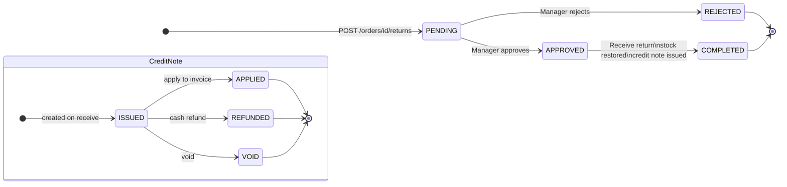
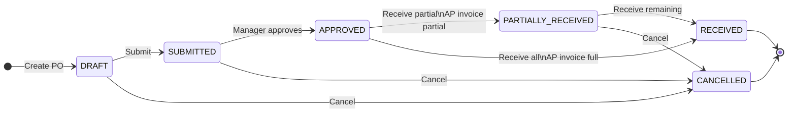
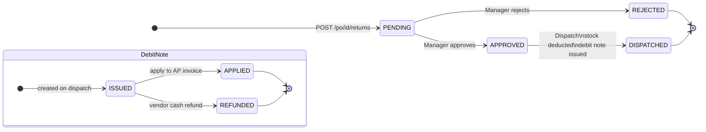
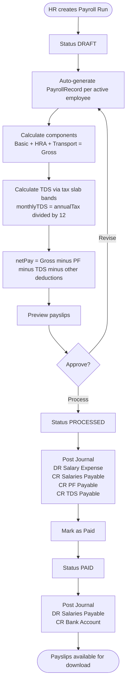
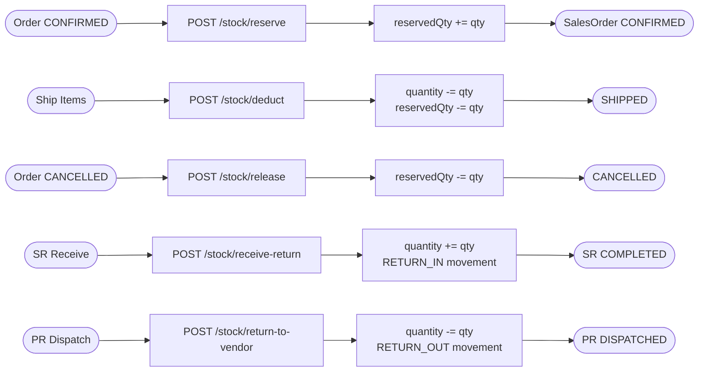
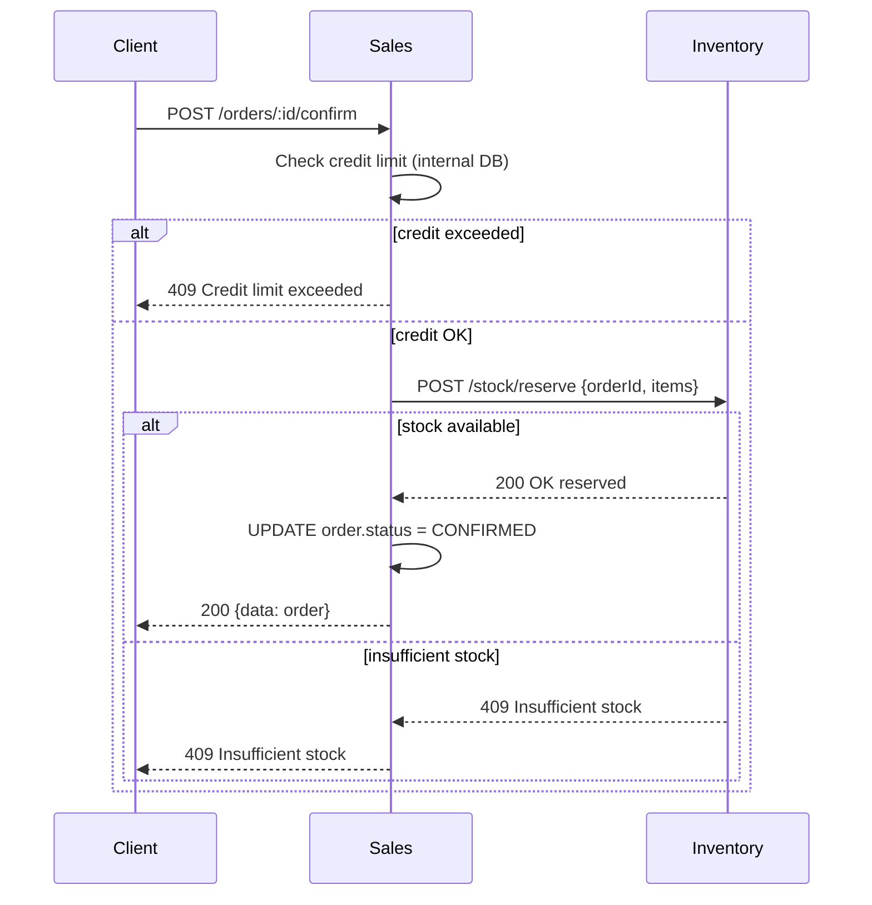
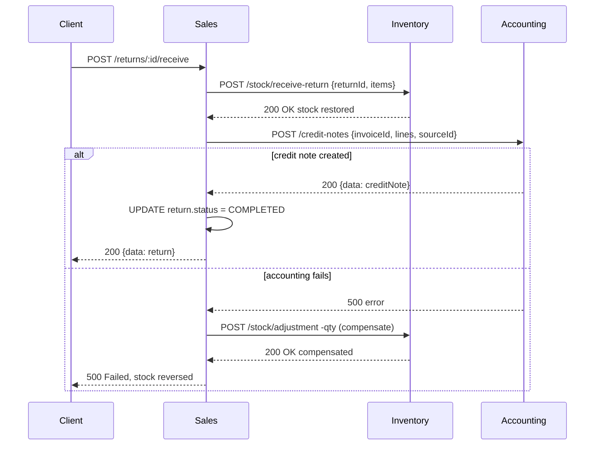

# ERP System — Complete UI Design Specification

> Modern SaaS ERP UI. Covers all 6 modules, 11 use cases, and 13 workflow diagrams.
> Stack: Next.js 15 App Router + Tailwind CSS + @erp/ui shared components.

---

## Table of Contents

1. [Design System](#1-design-system)
2. [Global Shell Layout](#2-global-shell-layout)
3. [Auth Pages](#3-auth-pages)
4. [Dashboard](#4-dashboard)
5. [Sales Module](#5-sales-module)
6. [Inventory Module](#6-inventory-module)
7. [Accounting Module](#7-accounting-module)
8. [HR Module](#8-hr-module)
9. [Procurement Module](#9-procurement-module)
10. [Workflow Visualizations](#10-workflow-visualizations)
11. [Responsive Design](#11-responsive-design)
12. [Component Patterns](#12-component-patterns)

---

## 1. Design System

### 1.1 Color Palette

| Token               | Hex       | Tailwind          | Usage                                      |
|---------------------|-----------|-------------------|--------------------------------------------|
| `primary`           | `#6366F1` | `indigo-500`      | CTA buttons, active nav, links             |
| `primary-dark`      | `#4F46E5` | `indigo-600`      | Button hover                               |
| `sidebar-bg`        | `#0F172A` | `slate-900`       | Sidebar background                         |
| `sidebar-text`      | `#94A3B8` | `slate-400`       | Inactive nav items                         |
| `sidebar-active-bg` | `#1E293B` | `slate-800`       | Hovered nav item bg                        |
| `surface`           | `#FFFFFF` | `white`           | Cards, modals, panels                      |
| `page-bg`           | `#F8FAFC` | `slate-50`        | Page background                            |
| `border`            | `#E2E8F0` | `slate-200`       | Card borders, input borders, dividers      |
| `text-heading`      | `#0F172A` | `slate-900`       | Page titles, card headings                 |
| `text-body`         | `#334155` | `slate-700`       | Body text, table cells                     |
| `text-muted`        | `#64748B` | `slate-500`       | Labels, captions, empty states             |
| `success`           | `#10B981` | `emerald-500`     | PAID, ACTIVE, APPROVED, RECEIVED           |
| `warning`           | `#F59E0B` | `amber-500`       | PENDING, PARTIAL, SUBMITTED, LOW STOCK     |
| `danger`            | `#EF4444` | `red-500`         | OVERDUE, REJECTED, CANCELLED, OUT OF STOCK |
| `info`              | `#3B82F6` | `blue-500`        | DRAFT, ISSUED, PARTIALLY_*                 |
| `purple`            | `#8B5CF6` | `violet-500`      | CONFIRMED, PROCESSED, OPPORTUNITY          |

### 1.2 Typography Scale

```
Font family: Inter (Google Fonts)

Size    Weight   Color          Usage
------  -------  -------------  -------------------------
30px    700      text-heading   Page titles (h1)
24px    600      text-heading   Section headings (h2)
18px    600      text-heading   Card headings (h3)
16px    600      text-heading   Sub-section labels (h4)
14px    500      text-body      Table cells, form inputs
14px    400      text-muted     Secondary labels, help text
12px    500      varies         Status badges, timestamps
12px    400      text-muted     Captions, metadata
```

### 1.3 Spacing System (4px base grid)

```
xs   4px     Tight gaps (badge padding, icon spacing)
sm   8px     Inner card padding, input padding
md   16px    Card padding, section gaps
lg   24px    Page section gaps
xl   32px    Major section separators
2xl  48px    Page-level top padding
```

### 1.4 Elevation & Shape

```
Card:        bg-white  border border-slate-200  rounded-xl  shadow-sm
Modal:       bg-white  rounded-2xl  shadow-2xl  ring-1 ring-slate-900/5
Input:       bg-white  border border-slate-300  rounded-lg  h-10  px-3
Button-lg:   h-10  px-6  rounded-lg  font-medium
Button-sm:   h-8   px-3  rounded-md  text-sm
Sidebar:     bg-slate-900  w-60  fixed left-0 top-0 h-full
Header:      bg-white  border-b border-slate-200  h-16  sticky top-0 z-30
```

### 1.5 Status Badge Color Map

```
DRAFT                bg-slate-100    text-slate-600
PENDING              bg-amber-100    text-amber-700
SUBMITTED            bg-amber-100    text-amber-700
APPROVED             bg-emerald-100  text-emerald-700
ACTIVE               bg-emerald-100  text-emerald-700
CONFIRMED            bg-violet-100   text-violet-700
PARTIALLY_SHIPPED    bg-blue-100     text-blue-700
PARTIALLY_RECEIVED   bg-blue-100     text-blue-700
SHIPPED              bg-emerald-100  text-emerald-700
RECEIVED             bg-emerald-100  text-emerald-700
COMPLETED            bg-emerald-100  text-emerald-700
PAID                 bg-emerald-100  text-emerald-700
INVOICED             bg-violet-100   text-violet-700
PROCESSED            bg-violet-100   text-violet-700
OVERDUE              bg-red-100      text-red-700
REJECTED             bg-red-100      text-red-700
CANCELLED            bg-red-100      text-red-700
VOID                 bg-slate-100    text-slate-500
ISSUED               bg-blue-100     text-blue-700
APPLIED              bg-emerald-100  text-emerald-700
REFUNDED             bg-emerald-100  text-emerald-700
```

---

## 2. Global Shell Layout

### 2.1 Dimensions

```
Sidebar:     240px wide (collapsed: 64px icon-only)
Header:      64px tall, sticky, z-30
Content:     flex-1, calc(100vh - 64px), overflow-y-auto, bg-slate-50, p-6
```

### 2.2 Shell Wireframe

```
+------------------------------------------------------------------------+
|  HEADER  (h-16, bg-white, border-b, sticky top-0, z-30)               |
|                                                                        |
|  [=] [ERP Logo] Acme Corp    [Search... Cmd+K]     [Bell(3)] [Anand v]|
+-------------------+----------------------------------------------------+
|                   |                                                    |
|  SIDEBAR          |   MAIN CONTENT  (flex-1, p-6, bg-slate-50)        |
|  (w-60, bg-       |                                                    |
|   slate-900,      |   [Page Title]              [+ Primary Action]    |
|   fixed h-full)   |   Home / Sales / Orders                           |
|                   |   ------------------------------------------------ |
|  [ERP Logo]       |                                                    |
|  Acme Corp   [v]  |   [Card KPI]  [Card KPI]  [Card KPI]  [Card KPI] |
|  ─────────────    |                                                    |
|                   |   +------------------------------------------+    |
|  MAIN             |   |                                          |    |
|   Dashboard       |   |   PAGE CONTENT                           |    |
|                   |   |   (table / kanban / form / split view)   |    |
|  SALES            |   |                                          |    |
|   Leads           |   +------------------------------------------+    |
|   Opportunities   |                                                    |
|   Quotes          |                                                    |
|   Orders          |                                                    |
|   Customers       |                                                    |
|   Returns         |                                                    |
|                   |                                                    |
|  INVENTORY        |                                                    |
|   Products        |                                                    |
|   Warehouses      |                                                    |
|   Stock           |                                                    |
|   Price Lists     |                                                    |
|   BOM             |                                                    |
|                   |                                                    |
|  ACCOUNTING       |                                                    |
|   Invoices        |                                                    |
|   Journals        |                                                    |
|   Credit Notes    |                                                    |
|   Debit Notes     |                                                    |
|   Bank Accounts   |                                                    |
|   Reports         |                                                    |
|                   |                                                    |
|  HR               |                                                    |
|   Employees       |                                                    |
|   Payroll         |                                                    |
|   Leave           |                                                    |
|   Tax Slabs       |                                                    |
|                   |                                                    |
|  PROCUREMENT      |                                                    |
|   Vendors         |                                                    |
|   Purchase Orders |                                                    |
|   P. Returns      |                                                    |
|                   |                                                    |
|  ─────────────    |                                                    |
|   Settings        |                                                    |
|   Help            |                                                    |
+-------------------+----------------------------------------------------+
```

### 2.3 Header Slots

```
Left:    Hamburger icon (mobile) | ERP Logo | Tenant name (from JWT)
Center:  Global search bar — Cmd+K shortcut — searches across all modules
Right:   [Bell icon] with unread badge (red dot, count)
         [Tenant switcher] — dropdown lists all user tenants, click to switch
         [Avatar + chevron] — dropdown: Profile, Settings, Sign out
```

### 2.4 Sidebar Behavior

```
Desktop:    w-60, always visible, collapsible to w-16 (icons only) via [=] button
Mobile:     Hidden by default. Slides in as overlay on hamburger click.
            Backdrop closes on click-outside.
Active item: Left border (4px, indigo-500) + bg-slate-800 + text-white
Section headers: uppercase, text-xs, text-slate-500, px-3, py-2
Hover state: bg-slate-800, text-white
Collapsed: show icon only (tooltip on hover)
```

---

## 3. Auth Pages

### 3.1 Login

```
Full screen: bg-gradient-to-br from-indigo-50 to-slate-100

+---------------------------------------------+
|                                             |
|   [ERP Logo  50px]                          |
|   Welcome back                              |
|   Sign in to your workspace                 |
|                                             |
|   Email address                             |
|   [____________________________________]    |
|                                             |
|   Password                  Forgot password?|
|   [____________________________________]    |
|                                             |
|   [         Sign In          ]              |
|        primary, w-full, h-11                |
|                                             |
|   ─────────── or ───────────                |
|                                             |
|   Don't have an account?  Create one        |
|                                             |
+---------------------------------------------+
  Card: max-w-md, mx-auto, mt-24, p-8
  rounded-2xl, shadow-xl, bg-white
```

### 3.2 Register

```
+---------------------------------------------+
|   [ERP Logo]                                |
|   Create your account                       |
|                                             |
|   Full name                                 |
|   [____________________________________]    |
|                                             |
|   Work email                                |
|   [____________________________________]    |
|                                             |
|   Password                                  |
|   [____________________________________]    |
|   Strength meter: [====          ] Weak     |
|                                             |
|   [       Create Account        ]           |
|                                             |
|   Already have an account? Sign in          |
+---------------------------------------------+
  Post-register -> redirect to Tenant Setup Wizard
```

### 3.3 Tenant Setup Wizard (4-step)

```
Step indicator (top of card):
  [1 Workspace] ──── [2 Modules] ──── [3 Team] ──── [4 Done]
  Completed steps: filled indigo circle. Current: outlined. Pending: gray.

─── Step 1: Workspace Details ───────────────────────────────────
  Company name     [_______________________________]
  Workspace slug   [_______________________________]  (auto-gen)
                   Your URL: app.erp.io/acme
  Currency         [USD — US Dollar          v]
  Timezone         [UTC                      v]
  Fiscal year start [January                 v]
                                         [Next -->]

─── Step 2: Purchase Modules ────────────────────────────────────
  Select the modules your team needs:

  +──────────────+  +──────────────+  +──────────────+
  | [x] Sales    |  | [x] Inventory|  | [ ] Accounting|
  |  Leads,Orders|  |  Products,   |  |  Invoices,   |
  |  Quotes, CRM |  |  Stock, BOM  |  |  Journals,   |
  |  $29/month   |  |  $19/month   |  |  Reports     |
  +──────────────+  +──────────────+  |  $39/month   |
  +──────────────+  +──────────────+  +──────────────+
  | [ ] HR       |  | [ ] Procure  |
  |  Employees,  |  |  Vendors,    |
  |  Payroll,    |  |  POs,Returns |
  |  Leave       |  |  $19/month   |
  |  $29/month   |  +──────────────+
  +──────────────+
                               [<-- Back]  [Next -->]

─── Step 3: Invite Team ─────────────────────────────────────────
  Add your team members (optional, do later):

  Email                         Role
  [____________________________] [SALES_REP       v]  [+ Add]
  [____________________________] [HR_MANAGER      v]  [+ Add]
  [____________________________] [ACCOUNTANT      v]  [+ Add]

  Pending invites:
  john@acme.com   SALES_REP     [Remove]
  jane@acme.com   HR_MANAGER    [Remove]

                               [<-- Back]  [Finish Setup]

─── Step 4: All Done! ───────────────────────────────────────────
  +──────────────────────────────────────+
  |                                      |
  |   [Large checkmark illustration]     |
  |                                      |
  |   Your workspace is ready!           |
  |   Acme Corp  •  2 modules active     |
  |   2 invitations sent                 |
  |                                      |
  |   [    Go to Dashboard    ]          |
  |                                      |
  +──────────────────────────────────────+
```

---

## 4. Dashboard

```
+------------------------------------------------------------------------+
|  Good morning, Anand!                       [+ New Order]  [+ New PO] |
|  Monday, May 25, 2026  •  Acme Corp                                   |
+------------------------------------------------------------------------+
|                                                                        |
|  +──────────────+  +──────────────+  +──────────────+  +────────────+ |
|  | Open Orders  |  |Overdue Inv.  |  | Low Stock    |  | Pending POs| |
|  |              |  |              |  |              |  |            | |
|  |     24       |  |   $12,400    |  |   8 items    |  |   3 POs    | |
|  | +12% vs last |  | 3 new today  |  | 2 critical   |  | awaiting   | |
|  | week         |  |              |  |              |  | approval   | |
|  | [View all]   |  | [View all]   |  | [View all]   |  | [View all] | |
|  +──────────────+  +──────────────+  +──────────────+  +────────────+ |
|                                                                        |
+────────────────────────────+───────────────────────────────────────── +
|                            |                                           |
|  Revenue (last 30 days)    |  CRM Pipeline                            |
|                            |                                           |
|  $84,200  +18% vs prev mo  |  Leads ──── Opps ──── Quotes ──── Won   |
|                            |   42          18         9          4     |
|  [Line chart: daily        |  [Horizontal funnel bar, value labels]   |
|   revenue bars, today      |  Total pipeline value: $284,000          |
|   highlighted in indigo]   |                                           |
|                            |                                           |
+────────────────────────────+───────────────────────────────────────── +
|                            |                                           |
|  AR Aging Snapshot         |  Recent Activity                         |
|                            |                                           |
|  [Stacked horizontal bar]  |  > Order SO-042 confirmed     2 min ago  |
|  Current    $24,048        |    by Anand Kumar                        |
|  1-30 days   $8,100        |  > Invoice INV-018 marked paid  1h ago   |
|  31-60 days  $3,200        |    by Jane Doe                           |
|  60+ days    $1,800        |  > PO-011 approved              3h ago   |
|                            |    by Manager Role                       |
|  [View AR Aging Report]    |  > Low stock: Gadget Pro (8 left)  6h    |
|                            |  > Employee Bob Kumar hired     today    |
|                            |                                           |
+────────────────────────────+─────────────────────────────────────────+
|                                                                        |
|  Upcoming Actions                                                      |
|  +────────────────────────────────────────────────────────────────+   |
|  | ! Invoice INV-053 overdue since May 23 — Beta Inc  $9,100      |   |
|  | ! SO-040 shipped but not invoiced — MegaSoft                   |   |
|  | i Payroll run for May not yet created — due in 6 days          |   |
|  +────────────────────────────────────────────────────────────────+   |
+------------------------------------------------------------------------+
```

---

## 5. Sales Module

### 5.1 Leads — Kanban Board

```
+------------------------------------------------------------------------+
|  Leads                      [+ New Lead]  [List view]  [Filter]        |
|  42 leads total             [Search name, company...]                  |
+------------------------------------------------------------------------+
|                                                                        |
|  NEW (12)          CONTACTED (8)    QUALIFIED (5)    DISQUALIFIED (3)  |
|  ─────────         ─────────────    ─────────────    ───────────────   |
|  ┌──────────┐      ┌──────────┐     ┌──────────┐                      |
|  │ Acme Ltd │      │ TechCorp │     │ MegaSoft │                      |
|  │ John Doe │      │ Jane S.  │     │ Bob K.   │                      |
|  │ [WEB]    │      │[REFERRAL]│     │[COLD CALL│                      |
|  │ @anand   │      │ @anand   │     │ @anand   │                      |
|  │ Today    │      │ 2d ago   │     │ 5d ago   │                      |
|  └──────────┘      └──────────┘     └──────────┘                      |
|  ┌──────────┐      ┌──────────┐     ┌──────────┐                      |
|  │ Beta Inc │      │ InnoTech │     │ AlphaCo  │                      |
|  │ ...      │      │ ...      │     │ ...      │                      |
|  └──────────┘      └──────────┘     └──────────┘                      |
|  [+ Add card]      [+ Add card]     [+ Add card]  [+ Add card]        |
|                                                                        |
+------------------------------------------------------------------------+
  Card on click: slide-over panel from right (no page navigation)
  Card drag-drop: changes status column
  Card colors: border-left 4px indigo on hover
```

### 5.2 Lead Detail Slide-over (right panel, w-[480px])

```
+──────────────────────────────────────────────────────+
|  Acme Ltd                             [Edit]  [x]    |
|  John Doe  •  john@acme.com  •  +1 555 0100          |
|                                                      |
|  [WEB]  [QUALIFIED]  Assigned: @anand               |
|                                                      |
|  [Overview] [Activities (3)] [Opportunity] [Files]   |
|  ───────────────────────────────────────────────     |
|                                                      |
|  Overview:                                           |
|  Company      Acme Ltd                               |
|  Position     Procurement Manager                    |
|  Notes        Interested in Sales + Inventory        |
|  Created      May 20, 2026                           |
|                                                      |
|  [Convert to Opportunity]                            |
|  ───────────────────────────────────────────────     |
|                                                      |
|  Activities:                       [+ Log Activity]  |
|  ┌─────────────────────────────────────────────┐    |
|  │ [CALL] Follow-up call          May 24  DONE │    |
|  │        Outcome: Interested, send proposal   │    |
|  ├─────────────────────────────────────────────┤    |
|  │ [EMAIL] Sent intro email       May 21  DONE │    |
|  └─────────────────────────────────────────────┘    |
|                                                      |
+──────────────────────────────────────────────────────+
```

### 5.3 Opportunities Pipeline (list view)

```
+------------------------------------------------------------------------+
|  Opportunities                    [+ New Opportunity]  [Kanban view]   |
|  [Stage: All v]  [Assigned: Me v]  [Date Range]                       |
+------------------------------------------------------------------------+
|     | Opportunity Name  | Value     | Prob | Stage        | Close Date |
|-----|-------------------|-----------|------|--------------|------------|
|     | Acme ERP Rollout  | $48,000   | 70%  | [PROPOSAL]   | Jun 30     |
|     | TechCorp Modules  | $24,000   | 40%  | [QUALIFY]    | Jul 15     |
|     | MegaSoft All-in   | $84,000   | 85%  | [NEGOTIATE]  | May 31     |
|     | Beta Starter      | $8,400    | 20%  | [PROSPECT]   | Aug 1      |
+------------------------------------------------------------------------+
  Probability shown as colored bar (0-100%, green at 80%+, amber 40-79%, red <40%)
```

### 5.4 Quotes

```
+------------------------------------------------------------------------+
|  Quotes                                           [+ New Quote]        |
|  [Status: All v]  [Customer: All v]  [Date Range]                     |
+------------------------------------------------------------------------+
|  Quote #  | Customer   | Valid Until | Subtotal | Discount | Status    |
|-----------|------------|-------------|----------|----------|-----------|
|  QT-0024  | Acme Ltd   | Jun 15      | $3,800   | $200     | [SENT]    |
|  QT-0023  | TechCorp   | Jun 10      | $1,800   | $0       | [DRAFT]   |
|  QT-0022  | MegaSoft   | May 30      | $9,100   | $500     | [ACCEPTED]|
+------------------------------------------------------------------------+

Quote Detail:
+──────────────────────────────────────────────────────────────────────+
|  QT-0024                [Edit]  [Send]  [Accept]  [Reject]  [Convert]|
|  Acme Ltd  •  Created May 20  •  Valid until Jun 15  •  [SENT]       |
+──────────────────────────────────────────────────────────────────────+
|  LINE ITEMS (60%)                      |  SUMMARY (40%)               |
|  ─────────────────────────────────     |  ──────────────────────────  |
|  Product     Qty  Price  Disc  Total   |  Subtotal      $3,800        |
|  Widget A     10  $200   5%    $1,900  |  Discount       -$200        |
|  Gadget Pro    5  $380   0%    $1,900  |  Tax (GST 18%)   $648        |
|                                        |  Total         $4,248        |
|  [+ Add Line]                          |  ──────────────────────────  |
|                                        |  Customer: Acme Ltd          |
|  Terms & Notes:                        |  Credit: $20k limit          |
|  Standard 30-day net payment.          |  Open AR: $4,048             |
|                                        |  Payment: Net 30             |
+────────────────────────────────────────+──────────────────────────────+
  [Convert to Order] button visible when status = ACCEPTED
```

### 5.5 Sales Orders — List

```
+------------------------------------------------------------------------+
|  Sales Orders                                     [+ New Order]        |
|  [Status: All v]  [Customer: All v]  [Date: This Month v]             |
+------------------------------------------------------------------------+
|  [ ] | Order #  | Customer   | Date    | Total   | Status             |
|------|----------|------------|---------|---------|-------------------- |
|  [ ] | SO-0042  | Acme Ltd   | May 25  | $4,248  | [CONFIRMED]        |
|  [ ] | SO-0041  | TechCorp   | May 24  | $1,800  | [PARTIALLY_SHIPPED]|
|  [ ] | SO-0040  | MegaSoft   | May 23  | $9,600  | [INVOICED]         |
|  [ ] | SO-0039  | Beta Inc   | May 22  | $550    | [CANCELLED]        |
|                                                         [< 1 2 3 >]   |
+------------------------------------------------------------------------+
  Bulk actions row (shows when rows checked): [Cancel Selected] [Export CSV]
```

### 5.6 Sales Order Detail

```
+────────────────────────────────────────────────────────────────────────+
|  SO-0042                              [Confirm]  [Ship]  [Cancel]      |
|  Acme Ltd  •  May 25, 2026  •  [CONFIRMED]                             |
+────────────────────────────────────────────────────────────────────────+
|                                                                        |
|  ITEMS TABLE (60%)                   SUMMARY PANEL (40%)              |
|  ─────────────────────────────────   ──────────────────────────────── |
|  Product      Qty  Shipped  Price    Subtotal          $3,800         |
|  Widget A      10     0     $200     Discount            -$200        |
|  Gadget Pro     5     0     $380     Tax (GST 18%)        $648        |
|                                      Total             $4,248         |
|  [+ Add Item]  (only if DRAFT)                                        |
|                                      Customer: Acme Ltd               |
|                                      Credit Limit: $20,000            |
|                                      Open AR:       $4,048            |
|                                      Payment Terms: Net 30            |
|  ORDER TIMELINE                                                        |
|  ─────────────────────────────────                                    |
|  ● DRAFT       May 25  09:00   created by Anand                       |
|  ● CONFIRMED   May 25  10:30   by Anand — stock reserved              |
|  ○ SHIPPED     (pending)                                              |
|  ○ INVOICED    (pending)                                              |
|                                                                        |
+────────────────────────────────────────────────────────────────────────+

Ship Modal (triggered by [Ship]):
+──────────────────────────────────────────+
|  Ship Items for SO-0042              [x] |
|  Warehouse  [Main Warehouse      v]      |
|                                          |
|  Item            Qty to Ship / Ordered   |
|  Widget A        [10_______]  /  10      |
|  Gadget Pro      [ 3_______]  /   5      |
|                                          |
|  Partial ship will create partial        |
|  invoice for shipped items only.         |
|                                          |
|  [Cancel]      [Confirm Shipment]        |
+──────────────────────────────────────────+
```

### 5.7 Sales Returns

```
+------------------------------------------------------------------------+
|  Sales Returns                                    [+ New Return]       |
|  [Status: All v]  [Customer: All v]  [Date Range]                     |
+------------------------------------------------------------------------+
|  Return #  | Order    | Customer | Items | Total   | Status            |
|------------|----------|----------|-------|---------|-------------------|
|  SR-0008   | SO-0039  | Acme     | 2     | $800    | [PENDING]         |
|  SR-0007   | SO-0035  | TechCorp | 1     | $400    | [APPROVED]        |
|  SR-0006   | SO-0030  | Beta Inc | 3     | $1,200  | [COMPLETED]       |
+------------------------------------------------------------------------+

Return Detail (PENDING):
+────────────────────────────────────────────────────────────────────────+
|  SR-0008                               [Approve]  [Reject]            |
|  Order SO-0039  •  Acme Ltd  •  [PENDING]                             |
|  Reason: Damaged in transit  •  Submitted by: @sales_rep              |
+────────────────────────────────────────────────────────────────────────+
|  Items to Return:                                                      |
|  Product      Qty  Unit Price  Total   Reason                         |
|  Widget A      4   $200        $800    [DAMAGED]                      |
|                                                                        |
|  Return Total: $800                                                    |
|                                                                        |
|  TIMELINE                                                             |
|  ● PENDING     May 25  11:00   submitted by Sales Rep                 |
|  ○ APPROVED    (awaiting manager action)                               |
|  ○ COMPLETED   (awaiting physical receipt)                             |
+────────────────────────────────────────────────────────────────────────+

Return Detail (COMPLETED — shows linked Credit Note):
|  ● COMPLETED   May 25  14:00   received at Main Warehouse             |
|                                                                        |
|  Credit Note:  CN-0004  •  $800  •  [ISSUED]                         |
|                                                                        |
|  [Apply to Invoice]   [Issue Cash Refund]                              |
```

---

## 6. Inventory Module

### 6.1 Products

```
+------------------------------------------------------------------------+
|  Products                [+ New Product]  [Import CSV]  [Export]       |
|  [Category: All v]  [Status: Active v]  [Search name or SKU...]        |
+------------------------------------------------------------------------+
|  [ ] | Image | SKU      | Name         | Category | Stock | Status     |
|------|-------|----------|--------------|----------|-------|------------ |
|  [ ] | [img] | WID-001  | Widget A     | Widgets  | 240   | Active      |
|  [ ] | [img] | GAD-020  | Gadget Pro   | Gadgets  | 8     | [LOW STOCK] |
|  [ ] | [img] | COM-005  | Component X  | Parts    | 0     | [OUT STOCK] |
|  [ ] | [img] | WID-002  | Widget B     | Widgets  | 150   | Active      |
+------------------------------------------------------------------------+
  Bulk: [Deactivate]  [Export]

Product Detail (tab layout):
+────────────────────────────────────────────────────────────────────────+
|  Widget A  •  WID-001                    [Edit]  [Deactivate]         |
|  [ACTIVE]  Widgets  •  Cost: $80  •  Reorder: 10                      |
|                                                                        |
|  [Overview] [Variants (3)] [Stock] [Price Lists] [BOM] [Movements]    |
|  ──────────────────────────────────────────────────────────────────── |
|  Overview:                                                             |
|  Description   Industrial-grade widget for heavy use                  |
|  Unit           pcs                                                    |
|  Cost Price    $80.00                                                  |
|  Reorder Level  10 units                                               |
|                                                                        |
|  Stock tab:                                                            |
|  Warehouse     Quantity  Reserved  Available                          |
|  Main WH        200       10        190                               |
|  North WH        40        0         40                               |
|  TOTAL          240       10        230                               |
+────────────────────────────────────────────────────────────────────────+
```

### 6.2 Warehouses & Stock Overview

```
+------------------------------------------------------------------------+
|  Stock Overview    [Warehouse: All v]  [Category: All v]  [Export]     |
+------------------------------------------------------------------------+
|  [Total SKUs: 148] [Stocked Value: $284k] [Low Stock: 8] [Out: 3]     |
+------------------------------------------------------------------------+
|  Product      | SKU     | Main WH | N.WH | Reserved | Available | !   |
|---------------|---------|---------|------|----------|-----------|-----|
|  Widget A     | WID-001 | 200     | 40   | 10       | 230       |     |
|  Gadget Pro   | GAD-020 | 8       | 0    | 0        | 8         |[LO] |
|  Component X  | COM-005 | 0       | 0    | 0        | 0         |[OUT]|
+------------------------------------------------------------------------+
  Quick actions:  [Adjust Stock]  [Transfer]  [Receive Stock]  [Movements]

Transfer Modal:
+──────────────────────────────────────────+
|  Transfer Stock                      [x] |
|  Product     [Widget A         v]        |
|  From WH     [Main Warehouse   v]        |
|  To WH       [North Warehouse  v]        |
|  Quantity    [50___________]             |
|  Notes       [____________________]      |
|  [Cancel]         [Transfer]             |
+──────────────────────────────────────────+
```

### 6.3 Price Lists

```
+------------------------------------------------------------------------+
|  Price Lists                              [+ New Price List]           |
+------------------------------------------------------------------------+
|  Name            | Currency | Default | Valid Until | Items | Status   |
|------------------|----------|---------|-------------|-------|--------- |
|  Standard USD    | USD      | [YES]   | --          | 148   | Active   |
|  Wholesale       | USD      | No      | Dec 2026    |  45   | Active   |
|  Export EUR      | EUR      | No      | --          |  80   | Active   |
+------------------------------------------------------------------------+

Price List Detail (with volume tiers):
+────────────────────────────────────────────────────────────────────────+
|  Standard USD                                   [+ Add Item]  [Edit]  |
+────────────────────────────────────────────────────────────────────────+
|  SKU      | Product    | Min Qty | Price   | Tier             |       |
|-----------|------------|---------|---------|------------------|-------|
|  WID-001  | Widget A   |   1     | $200.00 | Base price       | [Edit]|
|  WID-001  | Widget A   |  50     | $185.00 | 50+ units        | [Edit]|
|  WID-001  | Widget A   | 100     | $170.00 | 100+ units       | [Edit]|
|  GAD-020  | Gadget Pro |   1     | $400.00 | Base price       | [Edit]|
+────────────────────────────────────────────────────────────────────────+
  Tier rows grouped visually under same product (indented, lighter bg)
```

---

## 7. Accounting Module

### 7.1 Invoices (AR / AP)

```
+------------------------------------------------------------------------+
|  Invoices                                       [+ New Invoice]        |
|  [Type: AR v]  [Status: All v]  [Entity: All v]  [Month: May 2026 v]  |
+------------------------------------------------------------------------+
|  Invoice # | Entity      | Date    | Due     | Total   | Status       |
|------------|-------------|---------|---------|---------|--------------|
|  INV-0055  | Acme Ltd    | May 20  | Jun 19  | $4,248  | [SENT]       |
|  INV-0054  | TechCorp    | May 18  | Jun 17  | $1,800  | [PARTIAL]    |
|  INV-0053  | Beta Inc    | Apr 30  | May 30  | $9,100  | [OVERDUE]    |
|  INV-0052  | MegaSoft    | Apr 25  | May 25  | $2,400  | [PAID]       |
+------------------------------------------------------------------------+
  Filter tabs: [All] [AR] [AP]   Status tabs: [All] [Unpaid] [Overdue] [Paid]

Invoice Detail:
+────────────────────────────────────────────────────────────────────────+
|  INV-0055                              [Record Payment]  [Void]        |
|  Acme Ltd  •  May 20, 2026  •  Due Jun 19  •  [SENT]                  |
+────────────────────────────────────────────────────────────────────────+
|  LINE ITEMS (55%)                       SUMMARY (45%)                  |
|  ─────────────────────────────────      ─────────────────────────────  |
|  Description    Qty  Price   Total      Subtotal          $3,600       |
|  Widget A x10   10   $200    $2,000     Discount           -$200       |
|  Gadget Pro x4   4   $380    $1,520     Taxable           $3,400       |
|  Tax — GST 18%                  $612    Tax (GST 18%)       $612       |
|                                         Total             $4,212       |
|                                         Paid              $0.00        |
|  PAYMENTS                               Balance           $4,212       |
|  No payments recorded yet.              ─────────────────────────────  |
|                                         Customer: Acme Ltd             |
|                                         Terms:    Net 30               |
|                                         Due date: Jun 19, 2026         |
+────────────────────────────────────────────────────────────────────────+

Record Payment Modal:
+──────────────────────────────────────────+
|  Record Payment — INV-0055           [x] |
|  Outstanding: $4,212                     |
|                                          |
|  Amount       [$4,212.00_________]       |
|  Method       [Bank Transfer      v]     |
|  Bank Account [HDFC Current A/C   v]     |
|  Reference    [TXN-20260525-001___]      |
|  Date         [May 25, 2026       ]      |
|                                          |
|  [Cancel]         [Record Payment]       |
+──────────────────────────────────────────+
  Auto-posts journal on save:
  DR Bank Account (selected)
  CR Accounts Receivable
```

### 7.2 Credit Notes & Debit Notes

```
+------------------------------------------------------------------------+
|  Credit Notes                                     [+ New Credit Note]  |
|  [Status: All v]  [Type: All v]  [Entity: All v]                      |
+------------------------------------------------------------------------+
|  CN #    | Entity    | Date    | Total  | Linked Invoice | Status      |
|----------|-----------|---------|--------|----------------|-------------|
|  CN-0004 | Acme Ltd  | May 25  | $800   | INV-0039       | [ISSUED]    |
|  CN-0003 | TechCorp  | May 18  | $400   | INV-0033       | [APPLIED]   |
+------------------------------------------------------------------------+

Credit Note Detail:
+────────────────────────────────────────────────────────────────────────+
|  CN-0004  •  Acme Ltd  •  $800  •  [ISSUED]                           |
|  Source: Sales Return SR-0008  •  Linked Invoice: INV-0039            |
+────────────────────────────────────────────────────────────────────────+
|  Lines:                                                                |
|  Widget A  x4  @$200  =  $800                                         |
|                                                                        |
|  Actions:                                                              |
|  [Apply to Invoice]  — reduce open invoice balance                    |
|  [Issue Cash Refund]  — pay customer back via bank                    |
+────────────────────────────────────────────────────────────────────────+
```

### 7.3 Financial Reports

```
+------------------------------------------------------------------------+
|  Reports                                [Period: May 2026 v] [Export] |
+------------------------------------------------------------------------+
|  [P&L]  [Balance Sheet]  [Trial Balance]  [AR Aging]  [AP Aging]     |
|  [General Ledger]  [Tax Summary]  [Cash Flow]                         |
+------------------------------------------------------------------------+

P&L:
+──────────────────────────────────────────────────────+
|  Profit & Loss  •  May 1 – May 25, 2026              |
|  ─────────────────────────────────────────────────── |
|  REVENUE                                             |
|    Product Sales                        $84,200      |
|    Service Revenue                       $5,400      |
|  ─────────────────────────────────────────────────── |
|  Total Revenue                          $89,600      |
|                                                      |
|  COST OF GOODS SOLD                                  |
|    Materials & Inventory                $42,100      |
|  ─────────────────────────────────────────────────── |
|  Gross Profit                           $47,500  53% |
|                                                      |
|  OPERATING EXPENSES                                  |
|    Salaries & Benefits                  $24,000      |
|    Rent                                  $3,500      |
|    Other Operating                       $2,100      |
|  ─────────────────────────────────────────────────── |
|  Total Expenses                         $29,600      |
|                                                      |
|  NET INCOME                             $17,900  20% |
+──────────────────────────────────────────────────────+

AR Aging:
+──────────────────────────────────────────────────────────────────────+
|  AR Aging Report  •  As of May 25, 2026                              |
|  Customer      | Current | 1-30d  | 31-60d | 61-90d | 90d+  | Total |
|  Acme Ltd      | $4,212  |   --   |   --   |   --   |   --  |$4,212 |
|  TechCorp      |   --    | $1,800 |   --   |   --   |   --  |$1,800 |
|  Beta Inc      |   --    |   --   | $9,100 |   --   |   --  |$9,100 |
|  ─────────────────────────────────────────────────────────────────── |
|  TOTAL         | $4,212  | $1,800 | $9,100 |   --   |   --  |$15,112|
+──────────────────────────────────────────────────────────────────────+
```

---

## 8. HR Module

### 8.1 Employee Directory

```
+------------------------------------------------------------------------+
|  Employees                   [+ New Employee]  [Import]  [Export]      |
|  [Department: All v]  [Status: Active v]  [Search name or ID...]       |
+------------------------------------------------------------------------+
|     | Emp ID  | Name         | Department | Position        | Salary   |
|-----|---------|--------------|------------|-----------------|----------|
| [A] | EMP-001 | John Smith   | Sales      | Senior Rep      | $5,200   |
| [J] | EMP-002 | Jane Doe     | HR         | HR Manager      | $6,800   |
| [B] | EMP-003 | Bob Kumar    | Engineering| Lead Engineer   | $7,500   |
+------------------------------------------------------------------------+
  Avatar initials shown in circular badge (colored by department)

Employee Profile:
+────────────────────────────────────────────────────────────────────────+
|  [Avatar]  John Smith  EMP-001  [ACTIVE]       [Edit]  [Terminate]    |
|  Sales  •  Senior Sales Rep  •  Hired Jan 15, 2025  •  @john           |
+────────────────────────────────────────────────────────────────────────+
|  [Overview] [Payslips] [Leave Balance] [Salary History] [Documents]   |
|  ──────────────────────────────────────────────────────────────────── |
|  PERSONAL                          COMPENSATION (current period)      |
|  Email      john@acme.com          Basic          $3,120  (60%)       |
|  Phone      +1 555 0201            HRA            $1,248  (40% basic) |
|  Pay Grade  Senior                 Transport      $  400  (fixed)     |
|  Bank A/C   HDFC ****1234          Gross          $4,768              |
|  Hire Date  Jan 15, 2025           PF Deduction   $ -374  (12% basic)|
|                                    TDS            $ -892  (slab calc) |
|                                    Net Pay        $3,502              |
+────────────────────────────────────────────────────────────────────────+
```

### 8.2 Payroll Runs

```
+------------------------------------------------------------------------+
|  Payroll Runs                                [+ Create Payroll Run]    |
+------------------------------------------------------------------------+
|  Period   | Employees | Gross      | Net        | Status    |         |
|-----------|-----------|------------|------------|-----------|---------|
|  May 2026 | 24        | $142,800   | $118,400   | [DRAFT]   | [Open]  |
|  Apr 2026 | 24        | $140,200   | $116,100   | [PAID]    | [View]  |
|  Mar 2026 | 23        | $136,000   | $112,500   | [PAID]    | [View]  |
+------------------------------------------------------------------------+

Payroll Run Detail (DRAFT):
+────────────────────────────────────────────────────────────────────────+
|  Payroll — May 2026                    [Preview PDF] [Process]         |
|  24 employees  •  [DRAFT]  •  Created by Anand                        |
+────────────────────────────────────────────────────────────────────────+
|  Employee      | Basic    | Gross    | PF     | TDS    | Net Pay      |
|----------------|----------|----------|--------|--------|--------------|
|  John Smith    | $3,120   | $4,768   | $374   | $892   | $3,502       |
|  Jane Doe      | $4,080   | $6,248   | $490   | $1,380 | $4,378       |
|  Bob Kumar     | $4,500   | $6,900   | $540   | $1,620 | $4,740       |
|  ...           |          |          |        |        |              |
|  ─────────────────────────────────────────────────────────────────── |
|  TOTAL         |          | $142,800 |$11,420 |$13,180 | $118,200    |
+────────────────────────────────────────────────────────────────────────+
  [Process] -> confirm modal -> post journal -> status PROCESSED
  [Mark Paid] (when PROCESSED) -> bank journal -> status PAID
```

### 8.3 Leave Management

```
+------------------------------------------------------------------------+
|  Leave Requests                              [+ Request Leave]         |
|  [Status: Pending v]  [Employee: All v]  [Type: All v]                |
+------------------------------------------------------------------------+
|  Employee    | Type     | From     | To       | Days | Status         |
|--------------|----------|----------|----------|------|----------------|
|  John Smith  | ANNUAL   | Jun 2    | Jun 6    |  5   | [PENDING]  [A][R]|
|  Bob Kumar   | SICK     | May 26   | May 27   |  2   | [APPROVED]     |
|  Jane Doe    | PERSONAL | May 30   | May 30   |  1   | [PENDING]  [A][R]|
+------------------------------------------------------------------------+
  [A] = Approve button (green, MANAGER only)
  [R] = Reject button (red, MANAGER only)

Leave Balance Widget (right panel or employee profile):
+──────────────────────────────+
|  Leave Balances — FY 2026   |
|  ──────────────────────────  |
|  ANNUAL    12 used / 21 alloc|
|  ████████░░░░░░░░  57%       |
|  SICK       3 used / 10 alloc|
|  ███░░░░░░░░░░░░░  30%       |
|  PERSONAL   1 used /  5 alloc|
|  █░░░░░░░░░░░░░░░  20%       |
+──────────────────────────────+
```

---

## 9. Procurement Module

### 9.1 Vendors

```
+------------------------------------------------------------------------+
|  Vendors                                          [+ New Vendor]       |
|  [Status: Active v]  [Country: All v]  [Search name...]               |
+------------------------------------------------------------------------+
|  Vendor Name    | Email             | Country | Terms | Status        |
|-----------------|-------------------|---------|-------|---------------|
|  Supplier A     | ops@suppliera.com | US      | Net30 | Active        |
|  Supplier B     | info@supplierb.com| UK      | Net45 | Active        |
|  Supplier C     | ap@supplierc.com  | IN      | Net30 | Active        |
+------------------------------------------------------------------------+
```

### 9.2 Purchase Orders

```
+------------------------------------------------------------------------+
|  Purchase Orders                          [+ New Purchase Order]       |
|  [Status: All v]  [Vendor: All v]  [Date Range]                       |
+------------------------------------------------------------------------+
|  PO #    | Vendor     | Date    | Expected | Total    | Status        |
|----------|------------|---------|----------|----------|---------------|
|  PO-0023 | Supplier A | May 25  | Jun 5    | $12,000  | [APPROVED]    |
|  PO-0022 | Supplier B | May 20  | May 30   | $4,500   | [PART.RECVD]  |
|  PO-0021 | Supplier C | May 15  | May 25   | $8,200   | [RECEIVED]    |
+------------------------------------------------------------------------+

PO Detail (APPROVED — ready for receipt):
+────────────────────────────────────────────────────────────────────────+
|  PO-0023                                 [Receive Items]  [Cancel]    |
|  Supplier A  •  May 25  •  Expected Jun 5  •  [APPROVED]              |
|  Approved by: Manager  •  May 25, 11:45                               |
+────────────────────────────────────────────────────────────────────────+
|  Item            | Ordered | Received | Remaining | Unit Price | Total|
|------------------|---------|----------|-----------|------------|------|
|  Widget A        | 100     | 0        | 100       | $80        |$8,000|
|  Component X     | 200     | 0        | 200       | $20        |$4,000|
|  ─────────────────────────────────────────────────────────────────── |
|  Subtotal $12,000    Tax (GST) $2,160    Total $14,160                |
+────────────────────────────────────────────────────────────────────────+

Receive Items Modal:
+──────────────────────────────────────────+
|  Receive Items — PO-0023             [x] |
|  Warehouse   [Main Warehouse     v]      |
|                                          |
|  Item         Received / Ordered         |
|  Widget A     [60_______] / 100          |
|  Component X  [200______] / 200          |
|                                          |
|  Partial receipt will create AP invoice  |
|  for received items only.                |
|                                          |
|  [Cancel]    [Record Receipt]            |
+──────────────────────────────────────────+
```

### 9.3 Purchase Returns

```
+------------------------------------------------------------------------+
|  Purchase Returns                          [+ New Return]              |
|  [Status: All v]  [Vendor: All v]  [Date Range]                       |
+------------------------------------------------------------------------+
|  Return #  | PO        | Vendor     | Items | Total   | Status        |
|------------|-----------|------------|-------|---------|---------------|
|  PR-0003   | PO-0021   | Supplier C | 2     | $1,600  | [PENDING]     |
|  PR-0002   | PO-0018   | Supplier A | 1     | $800    | [DISPATCHED]  |
+------------------------------------------------------------------------+
  [Approve] / [Reject] buttons on PENDING (MANAGER only)
  [Dispatch] button on APPROVED
```

---

## 10. Workflow Visualizations

### UC2 — Lead to Cash

```mermaid
flowchart LR
    A([New Lead]) --> B[Lead NEW]
    B --> C[Lead CONTACTED]
    C --> D{Qualified?}
    D -- No --> E[DISQUALIFIED]
    D -- Yes --> F[Opportunity PROSPECTING]
    F --> G[Opportunity PROPOSAL]
    G --> H[Quote DRAFT]
    H --> I[Quote SENT]
    I --> J{Response?}
    J -- Rejected --> K[Quote REJECTED]
    J -- Accepted --> L[Quote ACCEPTED]
    L --> M[SalesOrder DRAFT]
    M --> N{Credit Limit OK?}
    N -- Fail --> O([409 Credit Limit Exceeded])
    N -- Pass --> P[Reserve Stock in Inventory]
    P --> Q[SalesOrder CONFIRMED]
    Q --> R[Ship Items]
    R -- partial --> S[PARTIALLY_SHIPPED + Partial Invoice]
    S --> R
    R -- all shipped --> T[SHIPPED + Full Invoice SENT]
    T --> U{Payment}
    U -- partial --> V[Invoice PARTIAL]
    V --> U
    U -- full --> W([Invoice PAID])
    Q -- cancel --> X[Release Stock]
    X --> Y([SalesOrder CANCELLED])
```



### UC10 — Sales Return and Credit Note



### UC3 — Procure to Pay



### UC11 — Purchase Return and Debit Note



### UC4 — Hire to Payroll



### UC5 — Stock Operations



### Cross-Service Sequence — Confirm Order



### Cross-Service Sequence — Sales Return Receive



---

## 11. Responsive Design

### Breakpoints

```
sm   640px    Mobile landscape / small tablet
md   768px    Tablet portrait
lg   1024px   Tablet landscape / small desktop
xl   1280px   Standard desktop
2xl  1536px   Large desktop / wide monitor
```

### Layout Adaptations

```
Sidebar:
  < lg:   Hidden. Hamburger [=] opens full-height overlay (w-72) with backdrop.
  >= lg:  Fixed left (w-60). Collapsible to w-16 (icon only) via pin button.

Header:
  < lg:   Logo + hamburger left, bell + avatar right. No search bar (tap to expand).
  >= lg:  Full header with center search bar.

KPI Cards row:
  < md:   2 columns (2x2 grid)
  >= md:  4 columns in single row

Data Tables:
  < md:   Horizontal scroll wrapper. Only key columns visible, rest hidden.
          OR: Card-stack view (each row = card with all fields).
  >= md:  Full table with all columns.

Order / PO Detail (split panel):
  < lg:   Stacked — items table on top, summary below. Full width.
  >= lg:  Side-by-side 60/40 split.

Modals:
  < sm:   Full-screen bottom sheet (slides up from bottom).
  >= sm:  Centered dialog (max-w-md or max-w-lg).

Charts (Dashboard):
  < md:   Hidden or replaced by single number KPI.
  >= md:  Full chart rendered.

Kanban Board (Leads):
  < lg:   Horizontal scroll. One column visible at a time with left/right chevrons.
  >= lg:  All columns visible side by side.
```

---

## 12. Component Patterns

### 12.1 Page Header

```tsx
// Every page follows this structure
<div className="flex items-center justify-between mb-6">
  <div>
    <h1 className="text-2xl font-semibold text-slate-900">{title}</h1>
    <Breadcrumb items={[{ label: "Home", href: "/" }, { label: title }]} />
  </div>
  <div className="flex gap-3">
    {secondaryActions}
    <Button variant="primary">{primaryAction}</Button>
  </div>
</div>
```

### 12.2 KPI Card

```
+─────────────────────────────────+
|  Icon (colored bg circle)       |
|  Metric Label      [trend pill] |
|  Large Number                   |
|  Subtext / comparison           |
|  [View all ->]                  |
+─────────────────────────────────+
  Props: label, value, trend (+ / -), trendValue, icon, color, href
  trend > 0: green pill, trend < 0: red pill
```

### 12.3 DataTable

```
Props:
  columns:      { key, label, sortable?, width?, render? (custom cell) }[]
  data:         T[]
  pagination:   { page, limit, total, pages }
  onPageChange: (page: number) => void
  selectable?:  boolean (shows checkboxes, enables bulk actions)
  bulkActions?: { label: string, variant: "primary"|"danger", action: (ids: string[]) => void }[]
  loading?:     boolean (shows skeleton rows)
  emptyMessage?: string
  onRowClick?:  (row: T) => void
  filters?:     ReactNode (slot for filter controls above table)
```

### 12.4 Status Badge

```tsx
// Usage: <StatusBadge status="CONFIRMED" />
// Auto-maps status string to bg/text color classes
const STATUS_MAP: Record<string, { bg: string; text: string }> = {
  DRAFT:               { bg: "bg-slate-100",   text: "text-slate-600"   },
  PENDING:             { bg: "bg-amber-100",   text: "text-amber-700"   },
  APPROVED:            { bg: "bg-emerald-100", text: "text-emerald-700" },
  CONFIRMED:           { bg: "bg-violet-100",  text: "text-violet-700"  },
  PARTIALLY_SHIPPED:   { bg: "bg-blue-100",    text: "text-blue-700"    },
  PARTIALLY_RECEIVED:  { bg: "bg-blue-100",    text: "text-blue-700"    },
  SHIPPED:             { bg: "bg-emerald-100", text: "text-emerald-700" },
  COMPLETED:           { bg: "bg-emerald-100", text: "text-emerald-700" },
  PAID:                { bg: "bg-emerald-100", text: "text-emerald-700" },
  OVERDUE:             { bg: "bg-red-100",     text: "text-red-700"     },
  REJECTED:            { bg: "bg-red-100",     text: "text-red-700"     },
  CANCELLED:           { bg: "bg-red-100",     text: "text-red-700"     },
  ISSUED:              { bg: "bg-blue-100",    text: "text-blue-700"    },
  APPLIED:             { bg: "bg-emerald-100", text: "text-emerald-700" },
  REFUNDED:            { bg: "bg-emerald-100", text: "text-emerald-700" },
  VOID:                { bg: "bg-slate-100",   text: "text-slate-400"   },
};
```

### 12.5 Timeline Component (Order / Return History)

```
Vertical line with event dots:

  ●───────── DRAFT       May 25, 09:00   created by Anand         (filled dot, primary)
  ●───────── CONFIRMED   May 25, 10:30   by Anand — stock reserved (filled dot, primary)
  ○───────── SHIPPED     (pending)                                 (empty dot, slate-300)
  ○───────── INVOICED    (pending)                                 (empty dot, slate-300)

  Completed event: filled indigo dot, dark text
  Pending event:   empty gray dot, muted text, italic
  Error event:     filled red dot, red text
```

### 12.6 Slide-over Panel (Lead / Return Detail)

```
Fixed right panel, slides in from right with smooth transition.
Width: w-[480px] on desktop, full-width on mobile.
Backdrop: semi-transparent overlay on left side.
Close: X button top-right, clicking backdrop, or pressing Escape.
Contains: entity title, badges, tab navigation, scrollable content.
Used for: Lead detail, Activity log, Return detail quick-view.
```

### 12.7 Confirm Action Modal

```
Trigger:  Any irreversible action (Confirm Order, Process Payroll, Approve Return,
          Cancel Order, Terminate Employee)

+──────────────────────────────────────────+
|  Confirm [Action Name]               [x] |
|  ──────────────────────────────────────  |
|  [Icon]                                  |
|  Are you sure you want to [action]?      |
|  Brief description of what will happen.  |
|  This cannot be undone.                  |
|  ──────────────────────────────────────  |
|  [Cancel]           [Confirm — primary]  |
|                   (or danger for deletes)|
+──────────────────────────────────────────+
```

### 12.8 Form Patterns

```
- Label above input (never placeholder-as-label)
- Required fields: asterisk (*) in label, red color
- Inline error below input: text-red-600 text-sm mt-1
- Submit button: bottom right, disabled + spinner during API call
- Cancel button: bottom left, ghost variant
- Success: close modal / redirect + green toast (4s auto-dismiss)
- API error: red inline message (not just toast)
- Zod errors: show first error per field below that field
```

### 12.9 Toast Notifications

```
Position:     Fixed top-right, stack vertically (gap-2), z-50
Types:        success (emerald), error (red), warning (amber), info (blue)
Auto-dismiss: success/info 4s | warning 6s | error 8s (or click X)
Animation:    slide in from right, fade out

Usage patterns:
  success: "Order SO-0042 confirmed successfully"
  error:   "Failed to confirm order: insufficient stock (Widget A)"
  warning: "Invoice INV-053 is now overdue"
  info:    "Stock reservation expires in 24 hours"
```

### 12.10 Empty States

```
Shown when table/list has no data.

+──────────────────────────────────────────+
|                                          |
|   [Relevant illustration / icon]         |
|                                          |
|   No [resource] found                   |
|   [Helpful subtitle / next action hint] |
|                                          |
|   [+ Create your first [resource]]       |
|                                          |
+──────────────────────────────────────────+
  Examples:
  "No orders yet — start by creating a quote"
  "No overdue invoices (great job!)"
  "No stock movements this period"
```

### 12.11 Page-level Route Structure

```
app/
  (auth)/
    login/page.tsx
    register/page.tsx
    forgot-password/page.tsx
    reset-password/page.tsx
  (app)/
    layout.tsx             <- Shell (Sidebar + Header)
    page.tsx               <- Dashboard
    sales/
      leads/page.tsx
      opportunities/page.tsx
      quotes/page.tsx
      quotes/[id]/page.tsx
      orders/page.tsx
      orders/[id]/page.tsx
      customers/page.tsx
      returns/page.tsx
      returns/[id]/page.tsx
    inventory/
      products/page.tsx
      products/[id]/page.tsx
      warehouses/page.tsx
      stock/page.tsx
      price-lists/page.tsx
    accounting/
      invoices/page.tsx
      invoices/[id]/page.tsx
      journals/page.tsx
      credit-notes/page.tsx
      debit-notes/page.tsx
      bank-accounts/page.tsx
      reports/page.tsx
    hr/
      employees/page.tsx
      employees/[id]/page.tsx
      payroll/page.tsx
      payroll/[id]/page.tsx
      leave/page.tsx
      tax-slabs/page.tsx
    procurement/
      vendors/page.tsx
      purchase-orders/page.tsx
      purchase-orders/[id]/page.tsx
      purchase-returns/page.tsx
    settings/
      page.tsx             <- Tenant settings, modules, team
```
